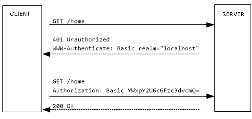

# 1. 스프링 시큐리티란?

스프링 시큐리티 레퍼런스에서는 'Java EE 기반의 소프트웨어 어플리케이션에 **포괄적인 보안 솔루션을 제공하는 프레임워크**'라고 정의하고 있다.
특히 스프링 프레임워크를 사용하여 구축된 프로젝트를 지원하는데 중점을 두고 있으며 보안에 대한 체계적이고 다양한 맞춤형 옵션을 제공해준다.
 **필터 기반으로 동작하며 따라서 MVC와 분리되어 보안을 관리할 수 있다.**

만약 서버 환경을 전환하는 경우, 일반적으로 새 환경에서 애플리케이션의 보안을 재구성하는데 많은 작업이 필요한데 스프링 시큐리티를 사용하면 이러한 문제가 해결된다.

# 2. 인증과 인가

인증과 인가는 스프링 시큐리티가 목표로 두고 있는 주요한 두 지점이다.

**인증(authentication)** 이란 권한을 가지고 있는 대상자를 골라내는 프로세스이며 지금 요청을 보낸 대상자(principal)가 누구인지 확인하는 과정이다.
**인가(authorization)** 는 인증을 완료한 대상자를 두고 해당 리소스에 어디까지 접근이 허용되는지 여부를 결정하는 과정이다.

'인가' 결정이 필요한 일이라면 이미 '인증' 절차에 의해 사용자의 신원은 밝혀진 이후일 것이다. (이러한 개념은 보편적이며 스프링 시큐리티에 특정된 것은 아니다.)

- **인증**: 이 리소스에 접근 요청을 한 것이 누구인가?
- **인가**: 이 인증된 요청은 어디까지 권한이 있나?


스프링 시큐리티는 상당히 유연한 인증 매케니즘(Basic auth, Form Based Authentication...etc)을 제공한다. 공식 문서에 나온 것만 하더라도 매우 다양하며,
오픈 플랫폼으로 스스로 인증 시스템을 만들어 사용할 수도 있다.

# 3. 인증 매커니즘

스프링 프레임워크가 가지고 있는 여러 인증 매커니즘 중 두 가지를 알아보자.

## 3.1 Basic auth

Basic authentication 은 'http request' 를 이용한 기본적인 인증 매커니즘이다.
사용자가 입력한 username, password를 Base64로 암호화하여 http request 에 넣은 후 서버에 전달하여 인증한다.

그런데 Basic authentication 은 사용자의 모든 리퀘스트 하나하나 마다 전부 유저네임과 패스워드를 실어서 보내고 서버는 그 리퀘스트를 일일히 확인한다.
따라서 모든 요청마다 로그인을 해아하며 '로그아웃' 이라는 개념도 없다.

✔️ Basic auth를 사용하려면 HTTPS를 이용하여 인증하는 것을 추천한다.



다음은 간략한 Basic Auth 설정 파일이다.

```java
@Configuration
@EnableWebSecurity
public class SpringSecurityConfiguration extends WebSecurityConfigurerAdapter {

    @Override
    protected void configure(HttpSecurity http) throws Exception {
        http
            .authorizeRequest()
            .antMatchers("/", "index", "/css/*", "/js/*").permitAll() //해당 URL 요청은 모두 허가함
            .antMatchers("/api/**").hasRole("ROLE_STUDENT") //해당 URL은 STUDENT ROLE을 가진 유저만 접근 가능
            //그 외에 모든 요청은 전부 인증되어야 함
            .anyRequets()
            .authenticated()
            .and()
            .httpBasic();
    }
}
```
> antMathers : ant 스타일 와일드 카드를 써서 패턴을 특정할 시 사용한다.

### 3.2 Form Based Authentication

대부분의 웹 애플리케이션이 사용하는 전통적인 세션-쿠키 인증 방식이다.


* HTML의 form 태그를 이용해 username과 password를 formData로 서버에 전송한다. (Content-Type은 application/x-www-form-urlencoded)
* 서버에서 인증 과정을 거친 후 성공하면, 쿠키에 인증 성공시 발행된 SESSIONID를 담는다.
* 사용자는 이 SESSIONID를 가지고 있다가 리퀘스트마다 실어 보낸다.
* 서버에서는 SESSIONID를 확인하고 알맞은 요청일 시 리소스에 접근을 허용한다.
* 로그아웃이 가능하다.(SESSIONID를 없애면 된다.)

다음과 같이 설정만 제대로 하면 스프링 시큐리티 에서 모든 기능을 제공해주기 때문에 개발자가 복잡한 로직을 짤 일이 없다.

```java

@Configuration
@EnableWebSecurity
public class SpringSecurityConfiguration extends WebSecurityConfigurerAdapter {

    @Override
    protected void configure(HttpSecurity http) throws Exception {
        http
            .authorizeRequest()
            .antMatchers("/", "index", "/css/*", "/js/*").permitAll()
            .antMatchers("/api/**").hasRole("ROLE_STUDENT")
            //any requests must e authenticated
            .anyRequets()
            .authenticated()
            .and()
            .formLogin()  //form based authentication
            .loginPage("/login") //로그인 페이지 url 지정(custom 할수 있다)
            .permitAll()
            .defaultSuccessUrl("/courses", true) //로그인 성공시 무조건 이 화면으로 간다.
            //만약 기본값 name인 password를 password123 이런식으로 바꾸고 싶다면..하지만 굳이 쓸 필요는 없음. 그냥 바꿔야할때 바꾸면 됨
            //view 페이지도 같이 바꿔줘야함
            .passwordParameter("pw1234")
            .usernameParameter("userid")
        .and()
        //defaults to 2 weeks
        .rememberMe() //로그인 시 로그인 유지 기능.
            .tokenValiditySeconds((int)TimeUnit.DAYS.toSeconds(21))
            .key("somethingverysecure")
            .rememberMeParameter("remember-me")
        //username, expiration time, md5 hash of the above 2 values
        .and()
        .logout()
            .logoutUrl("/logout")
            //when csrf is enabled must be delete this
            .logoutRequestMatcher(new AntPathRequestMatcher("/logout", "GET"))
            .clearAuthentication(true)
            .invalidateHttpSession(true)
            .deleteCookies("JSESSIONID", "remember-me")
            .logoutSuccessUrl("/login");

    }
}

```


이 포스팅에서는 스프링 시큐리티의 장점 중 하나로, '프레임워크가 알아서 다 해주기 때문에 개발자들은 복잡한 로직을 짤 필요가 없게 되었다' 라고 설명했다.
그렇다면 스프링 시큐리티 내부에서는 이러한 인증 과정을 어떻게 처리하고 있을까? 🤔

다음 포스팅에서는 스프링 시큐리티 내부 인증 과정을 자세히 알아보자.

